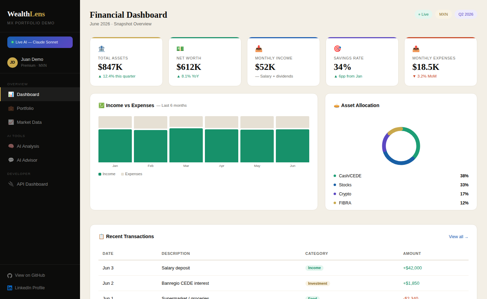
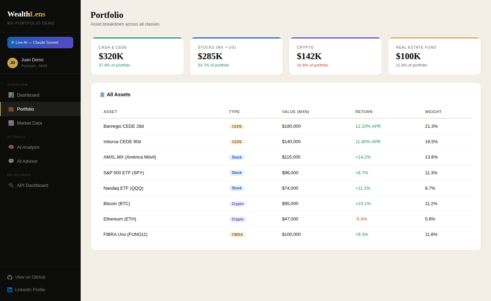
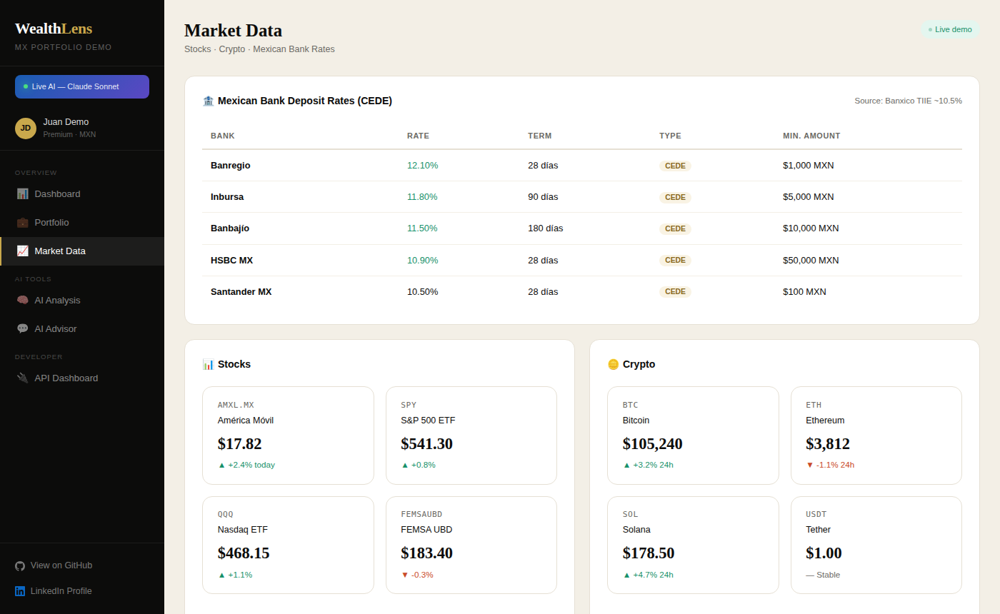
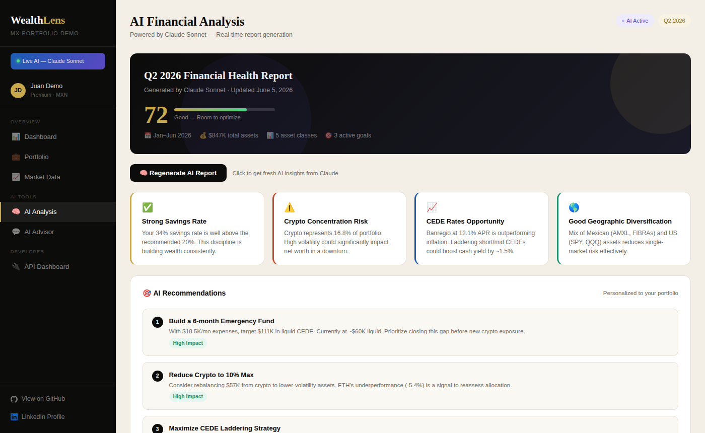
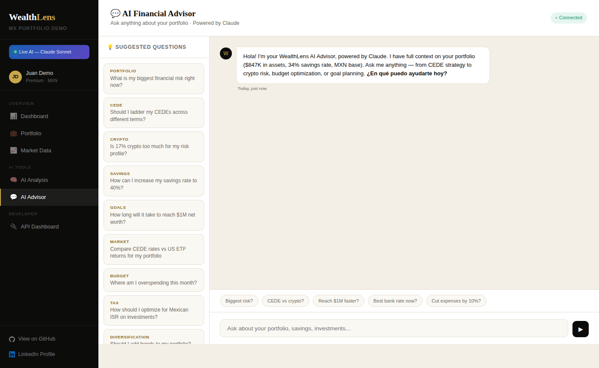
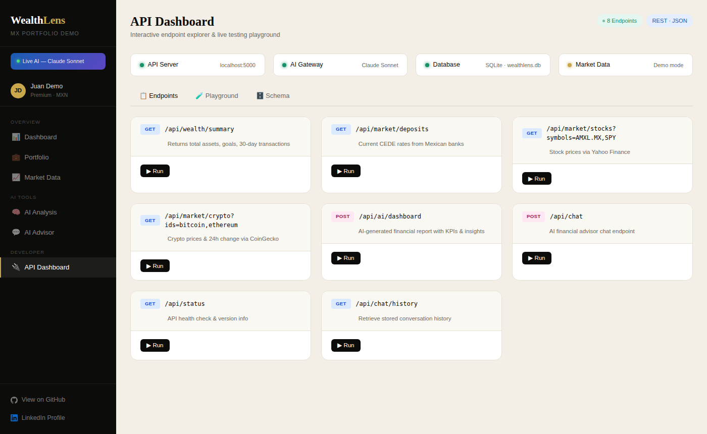

# 💰 WealthLens MX — AI-Powered Personal Finance Dashboard

<div align="center">

[](https://python.org)
[](https://flask.palletsprojects.com)
[](https://groq.com)
[](https://anthropic.com)
[](https://sqlite.org)
[](LICENSE)
[](https://wealthlens-mx.onrender.com/demo)

**A full-stack AI financial advisor for Mexican investors — tracks CEDEs, stocks, crypto & goals with live LLM-powered insights.**

[🚀 **Live Demo**](https://wealthlens-mx.onrender.com/demo) · [📖 API Docs](#-api-reference) · [🐛 Report Bug](https://github.com/crinatarajan/wealthlens-mx/issues) · [✨ Request Feature](https://github.com/crinatarajan/wealthlens-mx/issues)

> 🎯 **Try it instantly** — click Live Demo to auto-login with a pre-loaded demo account. No registration needed.

</div>

---

## ✨ Features

| Feature | Description |
|---|---|
| 🧠 **Dual AI Advisors** | Groq (LLaMA 3.3 70B) for financial dashboards + Claude Haiku for portfolio chat — real portfolio data injected as context |
| 📊 **Smart Dashboard** | LLM-generated health score (0–100), KPIs, income/expense trend charts, and AI recommendations |
| 🏦 **CEDE Rate Tracker** | Live Mexican bank deposit rates across 9 major banks — ranked by APR with term details |
| 📈 **Stock Market Data** | Real-time MX + US stock prices via Yahoo Finance (AMXL.MX, GMEXICOB.MX, SPY, QQQ, EWW and more) |
| 🪙 **Crypto Tracker** | Live BTC, ETH, SOL, XRP, BNB prices in MXN — cascade fallback: CoinGecko → CoinCap → stale cache |
| 💱 **Live FX Rates** | USD/MXN, EUR/MXN, GBP/MXN refreshed every 6 hours via open.er-api.com (no key required) |
| 🎯 **Goal Tracking** | Visual progress bars for financial goals with deadlines, priority ranking, and color coding |
| 💬 **Persistent AI Chat** | Multi-turn conversation history stored in SQLite; full portfolio context passed to every AI call |
| 📥 **Bank Statement Import** | CSV/Excel import with automatic bank format detection and AI auto-categorization (groceries, dining, transport, utilities, entertainment, health, shopping) |
| 🔄 **Recurring Tracker** | Track subscriptions and recurring income/expenses by frequency |
| 🔒 **Secure Auth** | Werkzeug password hashing, Flask sessions, session-based route protection |
| 🌐 **Bilingual** | Full English & Spanish — language preference stored per user, AI responds in the user's language |
| 🔌 **REST API** | 9 documented endpoints with an interactive in-app API playground |

---

## 🖥️ Screenshots

### 📊 Financial Dashboard

*AI health score, KPI cards, income vs expenses chart, asset allocation donut, and recent transactions*

### 💼 Portfolio Breakdown

*Full asset table across CEDEs, stocks (MX + US), crypto, and cash — values in MXN*

### 📈 Market Data

*Live Mexican bank CEDE rates, Yahoo Finance stock quotes, and CoinGecko/CoinCap crypto prices*

### 🧠 AI Financial Analysis

*Groq (LLaMA 3.3 70B) generates health score, executive summary, insights, and ranked recommendations*

### 💬 AI Advisor Chat

*Claude Haiku-powered advisor — full portfolio context injected, bilingual, persistent history*

### 🔌 API Dashboard

*Interactive endpoint explorer with one-click testing and live JSON responses*

---

## 🏗️ Architecture

```
wealthlens-mx/
│
├── app.py                    # Flask backend — all routes, AI logic, DB, APIs
├── wealthlens_demo.html      # Standalone HTML demo (no backend needed)
├── requirements.txt          # Python dependencies
├── .env.example              # Environment variable template
│
├── templates/
│   ├── wealthlens_demo.html  # Main dashboard UI (Vanilla JS + CSS custom props)
│   ├── api_dashboard.html    # Interactive API explorer
│   ├── login.html
│   └── register.html
│
└── uploads/                  # User-uploaded CSV/Excel files (gitignored)
```

---

## 🛠️ Tech Stack

| Layer | Technology | Details |
|---|---|---|
| **Backend** | Python 3.10+, Flask 2.x | REST API, session auth, file uploads |
| **Database** | SQLite (WAL mode) | 8 tables: users, assets, goals, transactions, budgets, recurring, alerts, chat_history |
| **AI — Dashboard** | Groq API (LLaMA 3.3 70B Versatile) | Structured JSON output: health score, KPIs, insights, recommendations |
| **AI — Chat** | Anthropic Claude Haiku 4.5 | Secure server-side proxy; portfolio system prompt injected; bilingual |
| **AI Gateway** | OpenAI-compatible interface | Swappable: Groq → DeepSeek → Ollama with one `.env` change |
| **Market Data** | Yahoo Finance API | Real-time MX + US stock prices (no key required) |
| **Crypto** | CoinGecko + CoinCap (cascade) | Live BTC/ETH/SOL/XRP/BNB — fallback chain + stale cache |
| **FX Rates** | open.er-api.com | USD/EUR/GBP/CAD to MXN, refreshed every 6 hours |
| **Auth** | Werkzeug + Flask sessions | Bcrypt password hashing, login_required decorator |
| **Frontend** | Vanilla JS, CSS custom properties | Playfair Display + DM Sans, responsive mobile layout |
| **Deployment** | Render (Gunicorn) | Free tier; `/ping` keep-alive endpoint included |

---

## ⚡ Quick Start

### 1. Clone the repo

```bash
git clone https://github.com/crinatarajan/wealthlens-mx.git
cd wealthlens-mx
```

### 2. Create a virtual environment

```bash
python -m venv venv
source venv/bin/activate        # macOS/Linux
venv\Scripts\activate           # Windows
```

### 3. Install dependencies

```bash
pip install -r requirements.txt
```

### 4. Configure environment variables

```bash
cp .env.example .env
```

Edit `.env`:

```env
# Required — free key at console.groq.com
GROQ_API_KEY=gsk_your_key_here

# Required for AI chat — get at console.anthropic.com
ANTHROPIC_API_KEY=sk-ant-your_key_here

# Required — generate with: python -c "import secrets; print(secrets.token_hex(32))"
SECRET_KEY=your-random-secret-here

# Optional — override AI model (default: llama-3.3-70b-versatile)
# AI_MODEL=llama-3.3-70b-versatile

# Optional — swap AI provider (see AI Configuration below)
# AI_BASE_URL=https://api.deepseek.com/v1/chat/completions

# Optional — CoinGecko demo key for higher rate limits
# COINGECKO_API_KEY=your_key_here
```

### 5. Run the app

```bash
python app.py
```

Open http://localhost:5000 — register an account and start tracking!

> **No API key?** Open `wealthlens_demo.html` directly in your browser for a fully interactive demo with no backend required.

---

## 🔌 API Reference

All endpoints require authentication (session cookie). Base URL: `http://localhost:5000`

| Method | Endpoint | Description |
|---|---|---|
| `GET` | `/api/status` | Health check, AI config status, FX rate, version |
| `GET` | `/api/wealth/summary` | Total assets, goal progress, 30-day cash flow |
| `GET` | `/api/market/deposits` | CEDE rates from major Mexican banks, ranked by APR |
| `GET` | `/api/market/stocks?symbols=SPY,AMXL.MX` | Real-time stock prices via Yahoo Finance |
| `GET` | `/api/market/crypto?ids=bitcoin,ethereum` | Live crypto prices in USD & MXN (CoinGecko/CoinCap) |
| `POST` | `/api/ai/dashboard` | LLM-generated financial report with health score + KPIs |
| `POST` | `/api/ai/chat` | Claude Haiku advisor chat (portfolio context injected) |
| `POST` | `/api/chat` | Groq-powered chat with personal financial context |
| `GET` | `/api/chat/history` | Last 20 stored AI conversations |
| `GET` | `/demo` | Auto-login with demo account — lands directly on dashboard |
| `GET` | `/ping` | Keep-alive endpoint (used by Render free tier) |

**Example — AI Chat:**

```bash
curl -X POST http://localhost:5000/api/ai/chat \
  -H "Content-Type: application/json" \
  -d '{"messages": [{"role": "user", "content": "What is my biggest financial risk?"}]}'
```

**Example Response:**

```json
{
  "ok": true,
  "answer": "Based on your portfolio, your crypto allocation at 17% exceeds the recommended 10% threshold. Your BTC and ETH holdings of ~$144,000 MXN represent meaningful concentration risk..."
}
```

---

## 🤖 AI Configuration

WealthLens uses an **OpenAI-compatible gateway** for the financial dashboard — swap providers with one `.env` change. The chat advisor always uses Claude Haiku via a secure server-side proxy.

| Provider | Speed | Cost | `.env` setting |
|---|---|---|---|
| **Groq** *(default)* | ⚡ Ultra-fast | Free tier | `AI_BASE_URL=https://api.groq.com/openai/v1/chat/completions` |
| **DeepSeek** | Fast | Very cheap | `AI_BASE_URL=https://api.deepseek.com/v1/chat/completions` |
| **Ollama** *(local)* | Moderate | Free | `AI_BASE_URL=http://localhost:11434/v1/chat/completions` |
| **OpenRouter** | Variable | Pay-per-use | `AI_BASE_URL=https://openrouter.ai/api/v1/chat/completions` |

The AI call stack includes:
- **Automatic retry** with exponential back-off (up to 3 attempts)
- **Rate limit handling** — respects `Retry-After` header on 429s
- **Graceful degradation** — demo responses served when no API key is configured

---

## 🗄️ Database Schema

SQLite database auto-created on first run (`wealthlens.db`), excluded from version control.

| Table | Purpose |
|---|---|
| `users` | Auth, preferred currency, language (EN/ES) |
| `assets` | Portfolio holdings with MXN value and type |
| `goals` | Financial goals — target, saved, deadline, priority, color |
| `transactions` | Income & expense ledger — CSV/Excel importable |
| `budgets` | Monthly category spending limits |
| `recurring` | Subscriptions and recurring income/expenses |
| `alerts` | Smart financial alerts (bilingual messages) |
| `chat_history` | Persistent AI conversation log |

---

## 🚀 Deployment

### Render (free tier — recommended)

1. Push to GitHub
2. New Web Service → connect repo
3. **Build command:** `pip install -r requirements.txt`
4. **Start command:** `gunicorn app:app`
5. Add environment variables in the Render dashboard:
   - `GROQ_API_KEY`
   - `ANTHROPIC_API_KEY`
   - `SECRET_KEY`

> The `/ping` endpoint is built in to keep your free-tier Render service warm.

### Railway

```bash
railway init
railway add
railway up
```

### Docker

```dockerfile
FROM python:3.11-slim
WORKDIR /app
COPY requirements.txt .
RUN pip install -r requirements.txt
COPY . .
CMD ["gunicorn", "app:app", "--bind", "0.0.0.0:8000"]
```

---

## 🗺️ Roadmap

- [ ] Plaid/Belvo open banking sync
- [ ] PDF bank statement parsing with AI categorization
- [ ] Push notifications for goal milestones
- [ ] Multi-currency rebalancing calculator
- [ ] Tax optimization module (ISR/SAT Mexico)
- [ ] Mobile PWA support
- [ ] Live CEDE rate scraping (replace static fallback)
- [ ] Streaming AI responses

---

## 🤝 Contributing

Pull requests are welcome! For major changes, open an issue first.

1. Fork the repo
2. Create your feature branch: `git checkout -b feature/amazing-feature`
3. Commit: `git commit -m 'Add amazing feature'`
4. Push: `git push origin feature/amazing-feature`
5. Open a Pull Request

---

## 📄 License

MIT License — free to use, modify, and distribute with attribution.

---

## 👤 Author

**Natarajan Narayanan** — Application Support Lead | Production Support Manager | IT Operations Manager

- 🌐 [Live Demo](https://wealthlens-mx.onrender.com/demo)
- 💼 [LinkedIn](https://www.linkedin.com/in/natrajnarayan/)
- 🐙 [GitHub](https://github.com/crinatarajan)
- 📧 crinatarajan@gmail.com

---

<div align="center">
Built with ❤️ and ☕ in Chicago, IL &nbsp;·&nbsp; If this helped you, please ⭐ the repo!
</div>
